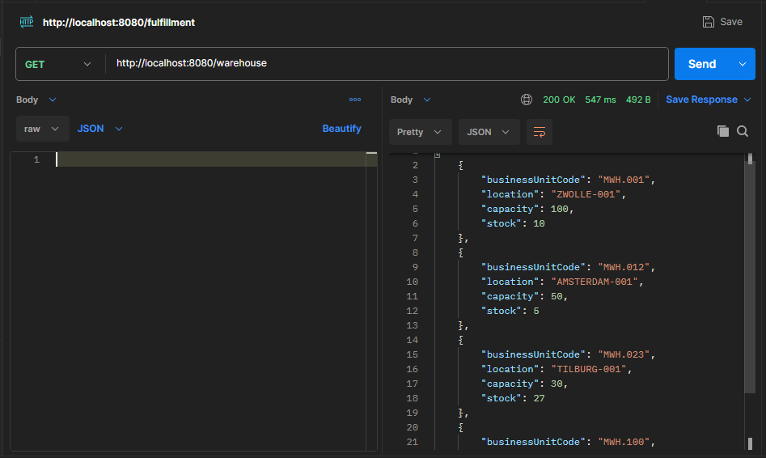
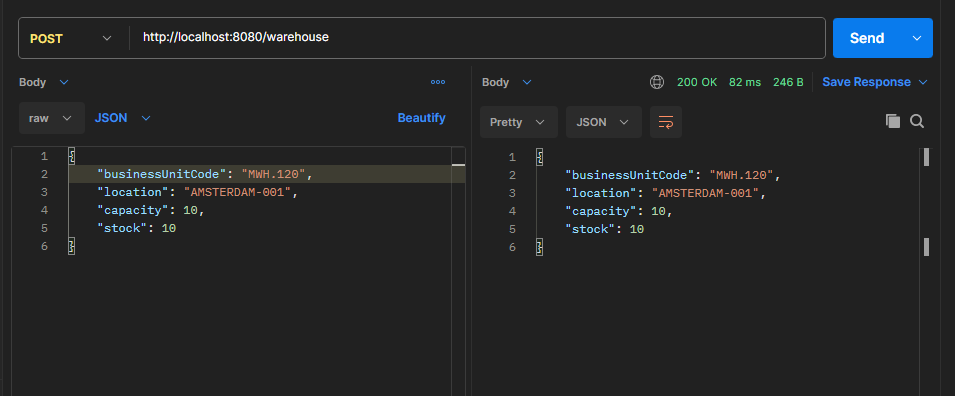
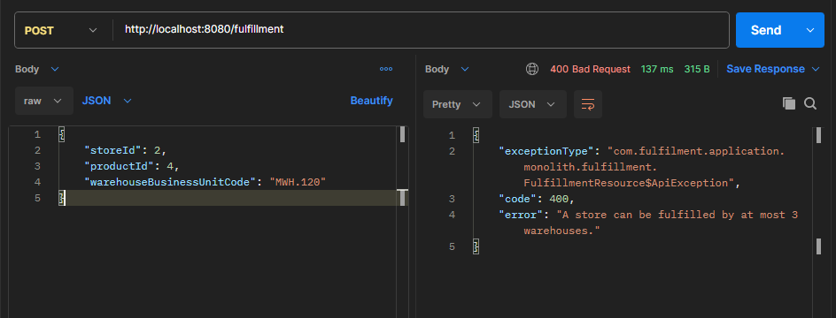
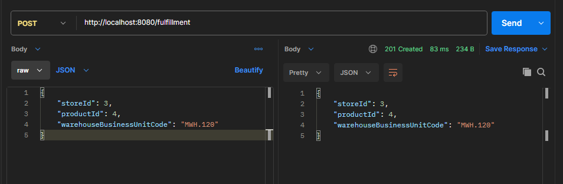
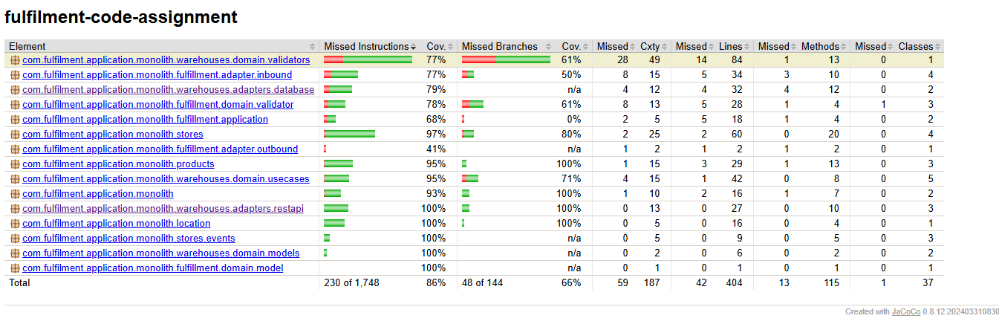

# Fulfilment Warehouse Management

A backend application for managing Stores, Warehouses, Locations and their fulfilment relationships.

The original assignment was provided as a Quarkus starter project. The implementation in this repository uses **Spring Boot 3.3.13** with **Java 17** while preserving the assignment requirements and business rules.
 
---

## 1. Domain

The application contains the following main entities:

- **Location** - Represents a geographical place/city.
- **Store** - Represents a physical store where products are stored and sold.
- **Warehouse** - Represents a location where products are kept before distribution to stores.
- **Product** - Represents goods sold to customers in stores.
- **Fulfilment Assignment** - Represents the relationship between a Store, Product and Warehouse.
  The main focus of the assignment is Warehouse and Store management and their relationships.

---

## 2. Implemented Requirements

### Location

- Resolve a Location using its identifier.
- Validate that the requested Location exists before creating or replacing a Warehouse.
### Store

- Store CRUD operations.
- Database changes are committed before calling the legacy Store Manager.
- Legacy Store Manager calls are registered using transaction synchronization and executed only after a successful transaction commit.
### Warehouse

Implemented:

- Create Warehouse
- Retrieve Warehouse
- Retrieve all active Warehouses
- Archive Warehouse
- Replace Warehouse
- Business Unit Code validation
- Location validation
- Maximum Warehouse limit per Location
- Warehouse capacity validation
- Stock/capacity validation
- Replacement stock validation
- Preservation of Business Unit Code during replacement
### Fulfilment

The bonus fulfilment requirements are also implemented:

- A Product can be fulfilled by a maximum of 2 different Warehouses for a Store.
- A Store can be associated with a maximum of 3 different Warehouses.
- A Warehouse can contain a maximum of 5 different Product types.
---

### Store Event Observer

Store creation and update operations publish application events inside the transaction.

`StoreEventObserver` listens using `@TransactionalEventListener(phase = TransactionPhase.AFTER_COMMIT)` and invokes the legacy Store Manager only after the database transaction has successfully committed.

This prevents the legacy system from being called when the Store transaction is rolled back.

## 3. Technology Stack

- Java 17
- Spring Boot 3.3.13
- Spring Data JPA
- Hibernate
- PostgreSQL
- H2 (for tests)
- Maven
- JUnit
- REST Assured
- JaCoCo
- GitHub Actions
---

## 4. Prerequisites

Make sure the following are installed:

- JDK 17 or higher
- Git
- PostgreSQL
- Maven Wrapper is included in the project
  Verify Java:

```bash
java -version
```
 
---

## 5. Database Setup

The application uses PostgreSQL by default.

### Default Database Configuration

| Setting  | Value         |
|----------|---------------|
| Database | `fulfilment`  |
| Host     | `localhost`   |
| Port     | `15432`       |
| Username | `fulfilment`  |
| Password | `fulfilment`  |

Create the PostgreSQL database and user before starting the application.

The application uses the following configuration:

```properties
spring.datasource.url=${DB_URL:jdbc:postgresql://localhost:15432/fulfilment}
spring.datasource.username=${DB_USERNAME:fulfilment}
spring.datasource.password=${DB_PASSWORD:fulfilment}
```

The default values can be overridden using environment variables.

For example:

```bash
DB_URL=jdbc:postgresql://localhost:5432/fulfilment
DB_USERNAME=fulfilment
DB_PASSWORD=fulfilment
```

Hibernate is configured with:

```properties
spring.jpa.hibernate.ddl-auto=create-drop
```

Therefore, the database schema is created when the application starts and dropped when the application stops.

> **Note:** `create-drop` is suitable for this assignment/demo setup. For a production application, a database migration tool such as Flyway or Liquibase would normally be preferred.
 
---

## 6. Build the Application

**Windows**

```bash
mvnw.cmd clean package
```

**Linux/macOS**

```bash
./mvnw clean package
```

To perform the complete build, test and coverage verification:

**Windows**

```bash
mvnw.cmd clean verify
```

**Linux/macOS**

```bash
./mvnw clean verify
```
 
---

## 7. Running Tests

The test suite uses an in-memory H2 database. Therefore, PostgreSQL is not required to execute the tests.

Run all tests:

**Windows**

```bash
mvnw.cmd clean test
```

**Linux/macOS**

```bash
./mvnw clean test
```

The tests cover:

- Location validation
- Store CRUD operations
- Warehouse creation
- Warehouse retrieval
- Warehouse archiving
- Warehouse replacement
- Invalid Warehouse requests
- Fulfilment constraints
- Product operations
- Error scenarios
---

## 8. Code Coverage

JaCoCo is configured for code coverage. The project enforces a minimum code coverage threshold of **80%**.

Run:

```bash
mvnw.cmd clean verify
```

The build will fail if the configured coverage requirement is not satisfied.

The JaCoCo report is generated at:

```
target/site/jacoco/index.html
```

Open the generated `index.html` file in a browser to view the detailed coverage report.
 
---

## 9. Run the Application

Before starting the application, make sure PostgreSQL is running and the required database is available.

**Windows**

```bash
mvnw.cmd spring-boot:run
```

**Linux/macOS**

```bash
./mvnw spring-boot:run
```

The application will start using the PostgreSQL configuration described above.
 
---

## 10. API Endpoints

### Store

```
GET     /store
GET     /store/{id}
POST    /store
PUT     /store/{id}
PATCH   /store/{id}
DELETE  /store/{id}
```

### Warehouse

```
GET     /warehouse
GET     /warehouse/{businessUnitCode}
POST    /warehouse
DELETE  /warehouse/{businessUnitCode}
POST    /warehouse/{businessUnitCode}/replacement
```

### Fulfilment

```
POST    /fulfillment
DELETE  /fulfillment/{id}
```
 
---

## 11. Warehouse Replacement

Warehouse replacement follows the special business rule defined in the assignment.

When replacing a Warehouse:

1. The existing Warehouse is located using its Business Unit Code.
2. The new Warehouse uses the same Business Unit Code.
3. The new Location must be valid.
4. The new capacity must be sufficient to accommodate the existing stock.
5. The new stock must match the existing Warehouse stock.
6. The old Warehouse is archived.
7. The new Warehouse is created while preserving the Business Unit Code.
   This allows the physical Warehouse to be replaced while preserving its Business Unit Code and historical information.

---

## 12. Transaction Handling

Store creation and update operations are executed inside Spring transactions.

The legacy Store Manager is invoked only after the database transaction has successfully committed.

The flow is:

```
Database Operation
        ↓
Spring Transaction
        ↓
Database Commit
        ↓
Legacy Store Manager Call
```

This prevents the downstream legacy system from receiving information about a Store change when the corresponding database transaction has failed or rolled back.
 
---

## 13. Project Structure

The project follows a layered/domain-oriented structure:

```
src/
├── main/
│   ├── java/
│   │   └── com.fulfilment.application.monolith/
│   │       ├── location/
│   │       ├── stores/
│   │       ├── warehouse/
│   │       ├── product/
│   │       └── ...
│   │
│   └── resources/
│       ├── application.properties
│       └── data.sql
│
└── test/
    └── java/
        └── com.fulfilment.application.monolith/
```

The Warehouse functionality uses a domain/application layer with a persistence adapter, while Store and Product use Spring Data JPA repositories.
 
---

## 14. CI/CD

GitHub Actions is configured to automatically build and test the application on pushes and pull requests.

The CI pipeline:

1. Checks out the source code.
2. Sets up JDK 17.
3. Uses the Maven Wrapper.
4. Builds the application.
5. Executes the test suite.
6. Runs JaCoCo coverage verification.
7. Fails the build if the configured coverage threshold is not met.
   The CI flow is:

```
Git Push / Pull Request
        ↓
  GitHub Actions
        ↓
       JDK 17
        ↓
 Maven Clean Verify
        ↓
    Test Suite
        ↓
  JaCoCo Coverage
        ↓
 Build Pass/Fail
```

The workflow configuration is available under:

```
.github/workflows/ci.yml
```
 
---

## 15. Assignment Documentation

The repository contains the following assignment documentation:

- **`BRIEFING.md`** - Contains the domain and business context for the assignment.
- **`CODE_ASSIGNMENT.md`** - Contains the implementation requirements and assignment details.
- **`QUESTIONS.md`** - Contains answers to the design and improvement questions provided as part of the assignment.
---

## 16. Configuration

The following environment variables can be used to override the default database configuration:

| Variable      | Default Value                                   | Description                |
|---------------|-------------------------------------------------|----------------------------|
| `DB_URL`      | `jdbc:postgresql://localhost:15432/fulfilment`  | PostgreSQL JDBC URL        |
| `DB_USERNAME` | `fulfilment`                                    | Database username          |
| `DB_PASSWORD` | `fulfilment`                                    | Database password          |
| `SHOW_SQL`    | `false`                                         | Enables Hibernate SQL logging |

Example:

```bash
DB_URL=jdbc:postgresql://localhost:5432/fulfilment
DB_USERNAME=fulfilment
DB_PASSWORD=fulfilment
SHOW_SQL=true
```
 
---

## 17. Notes

- The application uses PostgreSQL for normal runtime execution.
- Tests use an in-memory H2 database.
- The database schema is recreated on application startup because `spring.jpa.hibernate.ddl-auto` is configured as `create-drop`.
- Database credentials can be supplied through environment variables.
- JaCoCo enforces the configured minimum coverage threshold of 80%.
- GitHub Actions runs the Maven verification process to ensure that tests and coverage checks pass before the build is considered successful.

## Application Screenshots

### Warehouse API

The Warehouse API supports creating, retrieving, archiving and replacing warehouses.







### Fulfillment API

The Fulfillment API validates the warehouse/store/product relationship and applies the configured fulfillment limits.



### Test Coverage

JaCoCo is configured in the Maven build and the CI pipeline fails if the configured coverage threshold is not met.

The current overall instruction coverage is **86%**.

